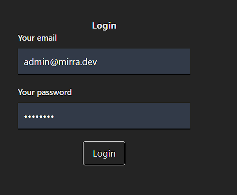
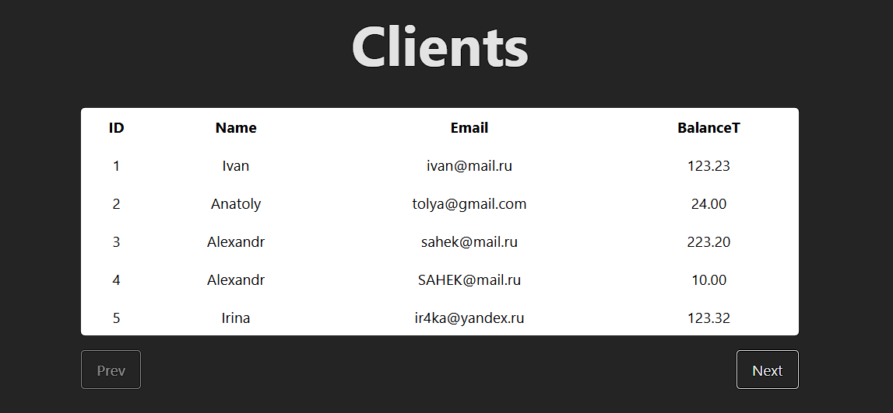
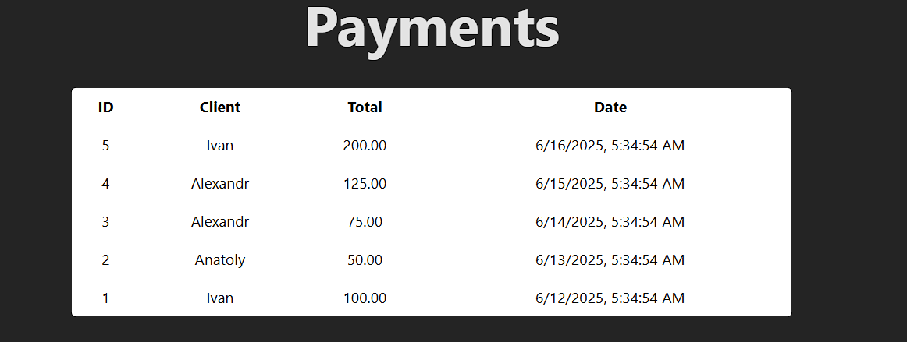
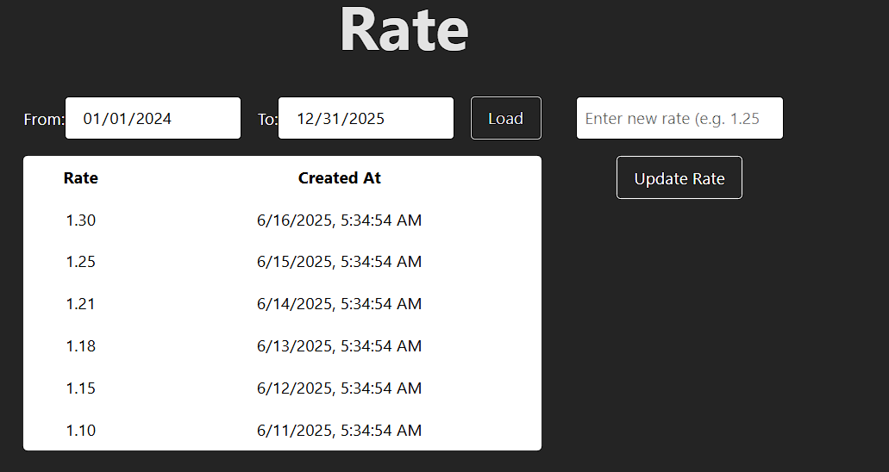

# admin-dashboard

## Серверная часть
1) Поскольку архитектура микросервисная, то, по-хорошему, надо разделить логику работы на сервис авторизации и админ-сервис
2) Для взаимодействия лучше иметь общий gateway, но по срокам можно не уложиться, поэтому пока без него
3) Использовал чистую архитектуру для сервисов
4) Две бдшки(для auth-service и admin-service) подняты на докере( см. docker-compose )
5) Для получения множества данных реализовал через пагинацию
6) Начальные миграции находятся в папке Migrations сервиса, слоя Infrastructure

Работа ручек:

## Клиентская часть

1) При логине, мы отправляем запрос на сервис авторизации, получаем токены, сохраняем их в localStorage
2) После удачного login'а переходим на /dashboard
3) Если accessToken истечет по сроку действия, то специальны интерцептор обновит его
4) Client работает пагинироваано для удобства просмотра
5) Payments - показывает 5 последних покупок токена
6) Rate токена - можно посмотреть исторю изменения или обновить курс

Интерфейс /login:

Интерфейс /dashboard:

## Запуск:
1) docker-compose для поднятия Postgres бд 
2) AuthService на 5000 порту, AdminService на 5001 порту
3) npm run dev
4) данные для входа: admin@mirra.dev / admin123
